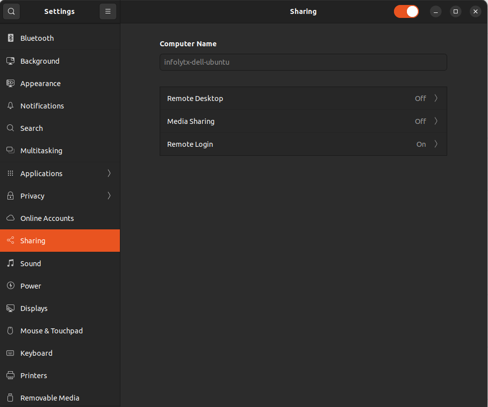
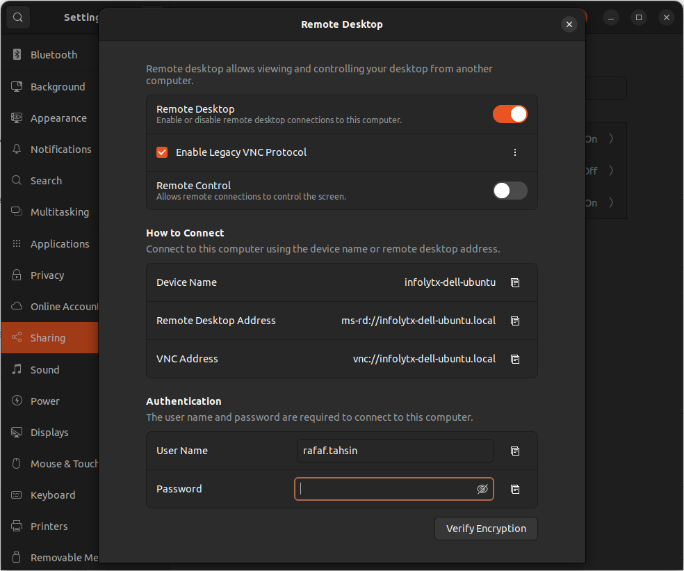

### Desktop File Example

```shell
$ cat ~/.local/share/applications/Appname.desktop 
### Copy to /home/.local/share/applications
[Desktop Entry]
Type=Application
Version=1.0
Name=Appname
Comment=Manage pgp keys
Icon=/home/rafaf.tahsin/Pictures/App-Icon.png
Exec="/opt/Appname.AppImage"
Terminal=false
```

Ref: https://specifications.freedesktop.org/desktop-entry-spec/desktop-entry-spec-latest.html


### Alow Remote Connection during screen lock

https://askubuntu.com/a/1491181/428566

### Ubuntu enable built in RDP Connection 

- Go to settings and select Remote Desktop



- Enable Remote Desktop



- Use RDP Client to connent

Ref: https://www.vpsserver.com/ubuntu-server-remote-desktop/


### Ubuntu Split Window

Shortcut : 

Split to The Left : `Window + <- `
Split to The Right : `Winodows + ->` 
`

Or

drag the window all the way to the left or right edge of the screen.

Ref: https://askubuntu.com/questions/586424/how-do-i-display-two-windows-as-split-screen


### Ubuntu short password

- https://askubuntu.com/questions/1466082/how-do-i-make-ubuntu-accept-a-short-password
- https://askubuntu.com/questions/180402/how-to-set-a-short-password-on-ubuntu
- 