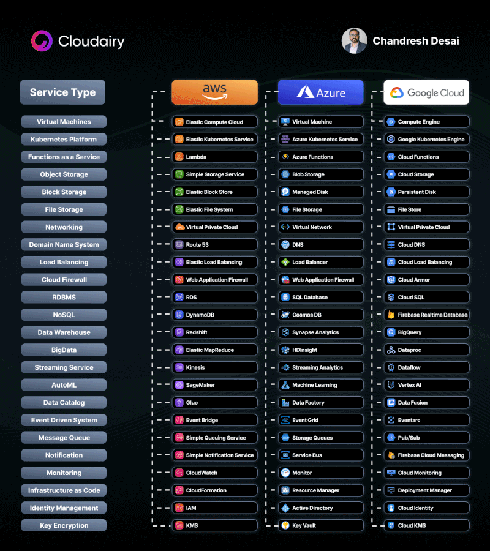

### Major Cloud providers
- AWS
- Brilliant Cloud [Bangladesh] - https://bcp.brilliant.com.bd/
- Rackspace
- Oracle
- Alibaba
- DigitalOcean
- Hetznar
- Azure
- GCP
- Vultr
- https://platform9.com/
- Huaweicloud
- linode
- [Ten Byte BD](https://www.tenbyte.io/)
- https://cloudxen.com/

### Major Cloud and their services comparison

### PaaS providers

- Zero DevOps Cloud
  - Heroku
  - Cloudfoundry
  - render.com
  - https://www.section.io/docs/
  - AWS Amplify
  - https://www.amazee.io/ - Container Paas
  - Cyclic - https://docs.cyclic.sh/ [ Mostly Containers ]
  - https://platform.sh/
  - rig.dev
  - https://hasura.io/ - GraphQL simplified
  - https://backendless.com/
  - Stackhero
- Self Hosted
  - dokku

### App Engine / Backend As a Service

- Airtable
- Google Firebase
- https://supabase.com/ - Firebase Alternative
- Amplication

### VM performance Comparison

- https://dev.to/dkechag/cloud-provider-comparison-2024-vm-performance-price-3h4l
- https://www.vpsbenchmarks.com/compare/ec2_vs_oracle
- https://docs.google.com/spreadsheets/d/e/2PACX-1vRgXdKU98EnDTTANJONPjUh61dNRwuYx8ClOmBkhHxc2oWfJnW0HDfS4kgPcDub850n7C0gz69AmIc1/pubhtml

### Self Hosted Cloud

- https://www.virtuozzo.com/cloud/
- https://www.virtualizor.com/
- https://www.openstack.org/
-
